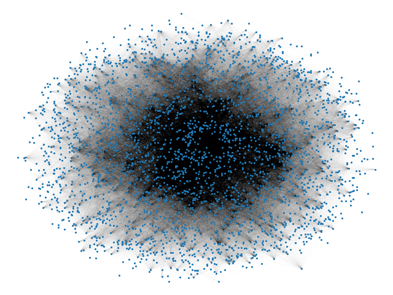

# ViralMarketing
<a href="https://docs.python.org/3.8/" target="_blank"></a>
</p>

## <font size=5 color=orange>Welcome to ViralMarketing Cascade Simulation !!!</font>
   

## Hello! Come and meet the team! (Members, Alphabetically Ordered)

- Elohan-Louis Lanier 
- Haonan Lin 
- Jérémy Wang 
- Molka Ben Marzouk 
- Yihang Zhao 
- Yixing Zhang 


# Group Wisdom in Action! 

## 0.Model and Analysis for this viral campaign

Details are in [Development.md](Development.md)

## 1. Development Log

### 1.1 Run `graph_v2.py`: 
- Generate the graph of this network. 
- Save the users data into [a csv file of users](/Csv/users.csv), and the followers data into [a csv file of followers](/Csv/users.csv),

### 1.2 Run `verification.py`: 
- Verify if there are users whose user_id is duplicated. 
- Verify that all followers in [follower list](/Csv/follower.csv) and users in [users list](Csv/user.csv) can correspond one to one (i.e. there’s no follower who’s not inclued in users list). 
- Verify that the graph generated by given data has the same number of nodes with the number of users

### 1.3 Run `score.py`:
- Calculate the betweeness centrality of all users, the score of engagement and reaction, then calculate the total influence score.
- Rank all users in ascending order with regard to their total influence score
- Save the engagement + reaction score into [a csv file](/Csv/Enga_Reac_Score.csv), and the total score ranking list into [a csv file](Csv/Engagement.csv)

### 1.4 Run `cascade.py`:

### 1.5 Run `postGraph.py`:

### 1. Run `propa_simulation.py`:
- Simulate 7-days propagation with 5 most infleuntial candidates with the highest scores and 5 randomly selected users.
- Get the 7-days propagation results (number of infected users and non_infected user for each day), and the development [graph](/assets/) and [animation](/assets) of 2 kinds of cascade


## 2. Basic of the Simulation (Computer Configurations)

### 2.1 Environment required to run this simulation

`Python 3` ,  `networkx`, `statistics`, `ndlib`, `matplotlib` should be installed in advance  !  

```
pip install [package]
```
```
pip3 install [package]
```
 in the command terminal if you haven't already installed it.

### 2.2 Structure of the files

#### Main Files

- [score.py](score.py): Calculate the influential score of all users, select the most influential ones
- [propa_simulation.py](/propa_simulation.py): Model simulation and comparative test.
- [cascade.py](/cascade.py): 

#### Support Files

- [verification.py](/ant.py): Verify if the graph and data is correct
-  [graph_v2.py](/cell.py): Generate graph, extract important data

- [postGraph.py](/gui_utils.py): 

####  Assets Folder

- [./assets/](/assets/):  Images and gifs for the simulation
- [./Csv/](/Csv/): Supported and generated csv files
- [./TXT/](./TXT/): Supported and generated txt files

####  Description Files

- [README.md](/README.md) : Provides details for code regarding the usage instructions

- [Development.md](/Development.md) : Provides details and analysis of the model 


<a href="https://networkx.org/documentation/stable/" target="_blank"></a>
</p>